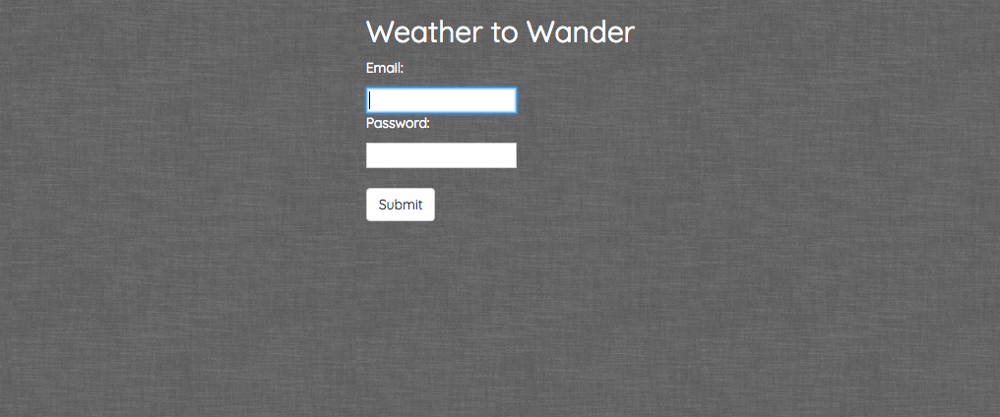
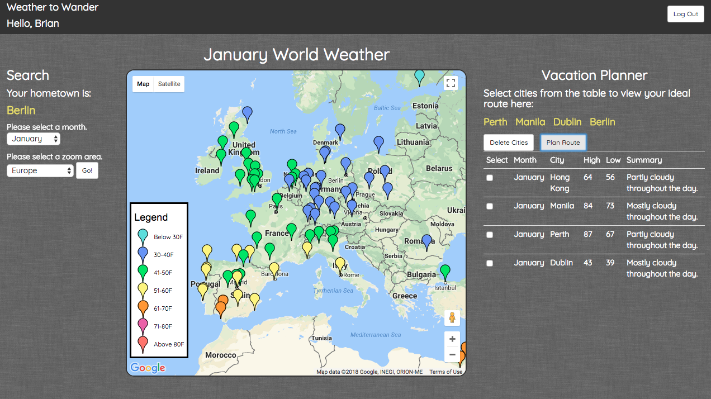
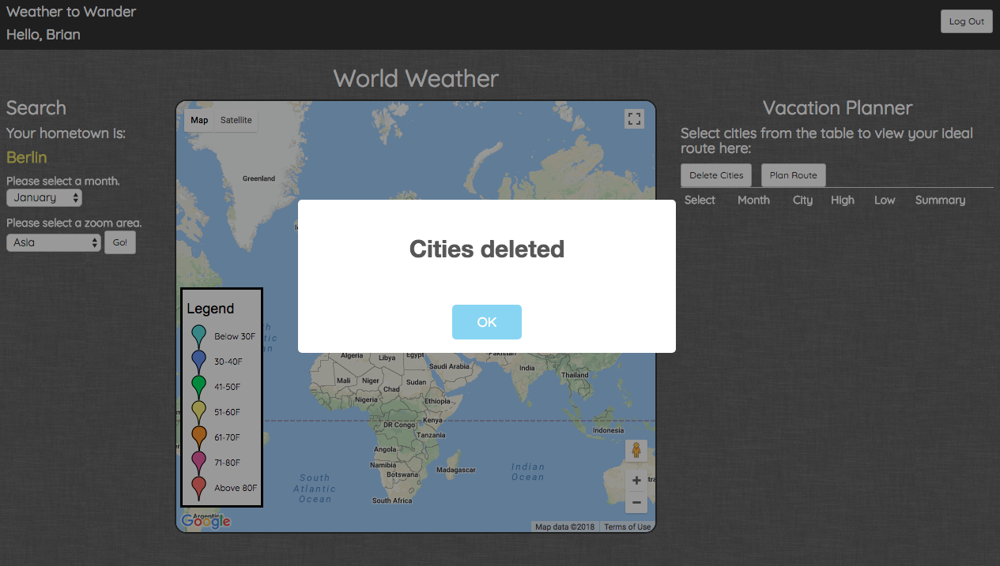

## About

Weather to Wander is a travel planning app I built for my final class project.
It uses weather data from the Dark Sky API and Google maps to provide monthly 
weather predictions for world cities. It also provides a route planning tool that 
calculates the best path prioritizing the last leg as the shortest route home in a 
multi-city vacation. I built it because I wanted users to be able to decide where 
to vacation based on weather without having to cross reference multiple websites. 
Planning a multi-city vacation can be complicated. It's difficult to decide on a 
route, but this app makes that easier. The last flight is always the most miserable, 
so I minimized user suffering by making certain it would be as short as possible.

## Testing and Development

Weather to Wander was developed using Test Driven Development and has significant 
statement and branch coverage in the backend. It was my goal to get as much logical 
coverage as possible. The route planning tool is implemented using a graph
class and modified version of Dijkstra's algorithm. The map and markers were
implemented with the Google Maps API and the Darksky API.

## Features

Users register and their password is hashed and then stored in the database. They
also save their hometown to their profile by chosing it from the map. 

## Searching by Region and Weather
Users can filter searches by world region, month, or both in order to view 
city specific weather data. Clicking on a city marker will reveal an info 
window with additional details and gives users the option to save the city to 
their vacation planner. 

## Route Planning
The vacation planner will calculate a a route home using selected cities from 
the side bar, guaranteeing the last leg is the shortest. It will display the 
route above the saved cities table. 

## Delete Cities
If a user no longer wants to keep a city in their vacation planner, they can simply
delete it.

This app has 98% test coverage of the backend and was developed using test driven
development.

## Tech Stack

Flask, PostgreSQL, JQuery, SQLAlchemy, bcrypt, JSON, geopy, HTML, CSS, 
Bootstrap, Python, AJAX, Jinja

## Author

I am a former professional athlete turned developer who is passionate about test driven 
development and the study of algorithms.
linkedin.com/in/amy-sowash/
